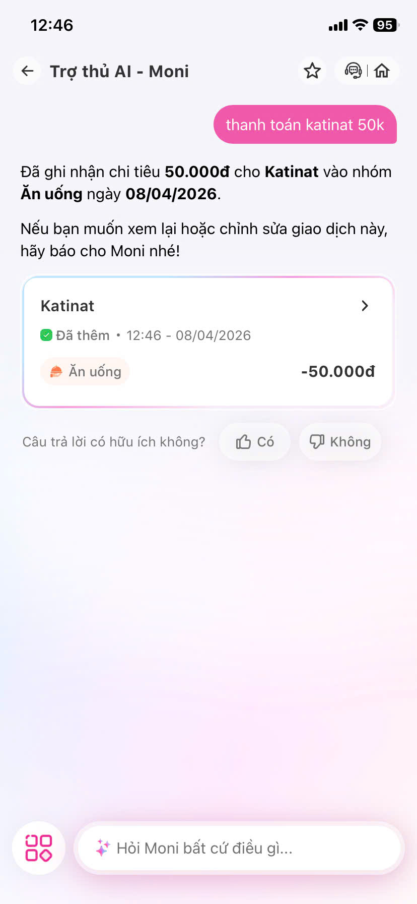
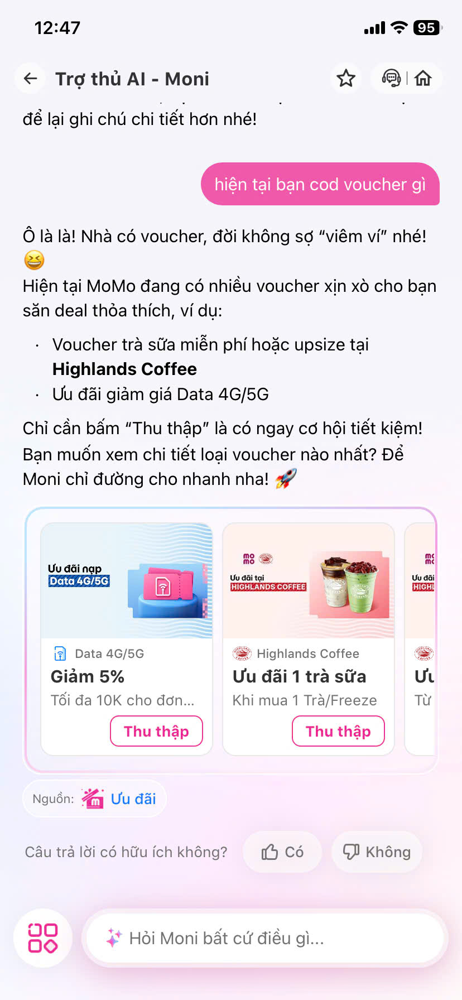
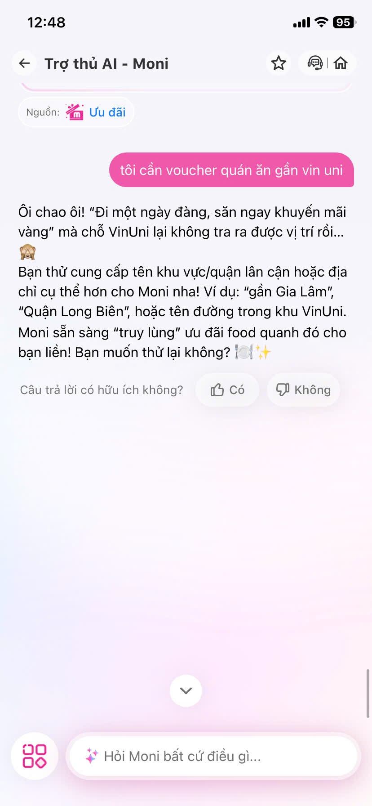
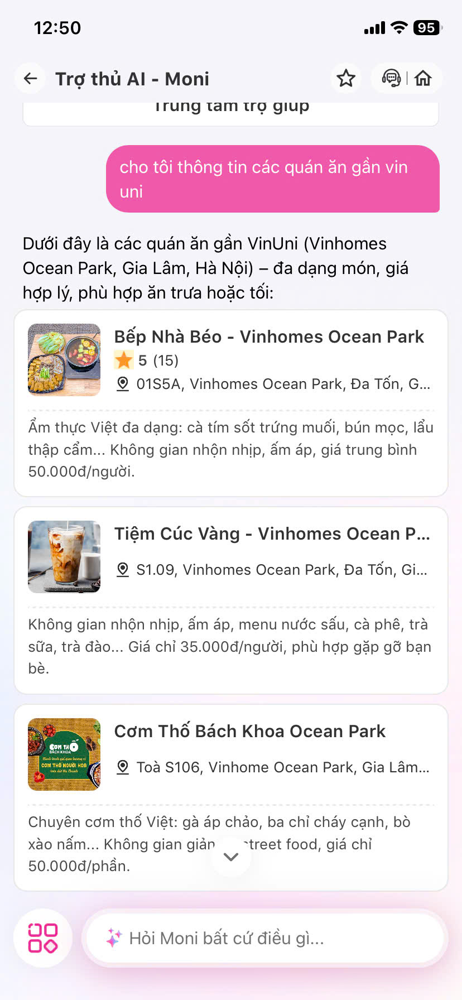
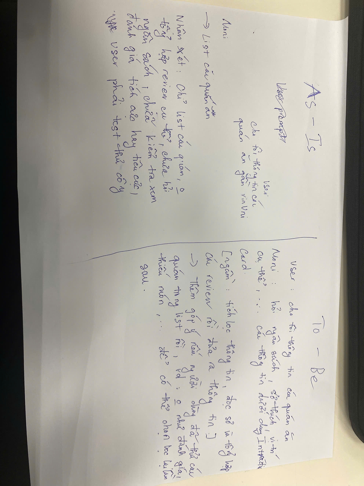

# PHÂN TÍCH UX SẢN PHẨM AI
**Sản phẩm lựa chọn:** MoMo — Trợ thủ AI Moni

### 1. KHÁM PHÁ (15')
* **Marketing (Lời hứa):** Định vị Moni là "nhân vật phụ xuất sắc", có sự thấu cảm, giúp tự động hóa 100% việc ghi chép/phân loại chi tiêu "thảnh thơi" và độ chính xác cao. Chatbot hiểu ngôn ngữ tự nhiên thông minh. Đóng vai trò như một "người quản gia" tài chính cá nhân, giúp người dùng quản lý chi tiêu hiệu quả, đưa ra các quyết định tài chính thông minh và tối ưu hóa trải nghiệm trên nền tảng.
* **Thực tế dùng thử (Độ khớp):** Khớp một phần với các hóa đơn rõ ràng (điện nước, siêu thị lớn). Tuy nhiên, với chuyển khoản cá nhân hoặc câu lệnh chat phức tạp, AI hay bị "điểm mù ý định" (hiểu sai). Tính năng gửi quá nhiều thông báo (push notification) gây ngợp, đi ngược lại triết lý "tinh giản, thấu cảm".

### 2. PHÂN TÍCH 4 PATHS (10')
* **Khi ĐÚNG → User thấy gì?**
    * Giao dịch (VD: thanh toán Katinat) tự động được gắn tag "Ăn uống" và nhảy thẳng vào biểu đồ trực quan. 
    * *Cảm xúc:* "Wow", thấy AI tiện lợi, rảnh tay.
    
    
* **Khi KHÔNG CHẮC → Hệ thống làm gì?**
    * AI không có xu hướng gợi ý 1 khu vực cụ thể
    * *Điểm gãy:* Thiếu cơ chế cập nhập cái xu hướng tại 1 khu vực cụ thể
    
* **Khi SAI → Sửa thế nào?**
    * AI tự tin gán sai (VD: hỏi các quán ăn gần Vin Uni). AI tự tin list các cửa hàng nhưng chưa hỏi ngân sách, sở thích, chưa đọc review coi có seeding hay không... dẫn đến việc user không biết nên chọn quán nào, có thể trải nghiệm khác so với đánh giá.
    * *Điểm gãy:* Xem review thủ công từng quán. Phải thoát ra → đọc review từng quán → bấm chi tiết → cuộn tìm danh mục → qua cửa hàng khác (Mất thời gian).
    
* **Khi MẤT TIN → Có exit (thoát hiểm) không?**
    * Khi chat với Moni mà AI không hiểu 2-3 lần liên tiếp, user bực bội muốn gặp nhân viên thật.
    * *Điểm gãy:* Có nút "Gặp tư vấn viên" trực tiếp. Trải nghiệm đứt gãy vì user phải đợi tư vấn viên liên lạc lại.

### 3. SKETCH TO-BE (10')
